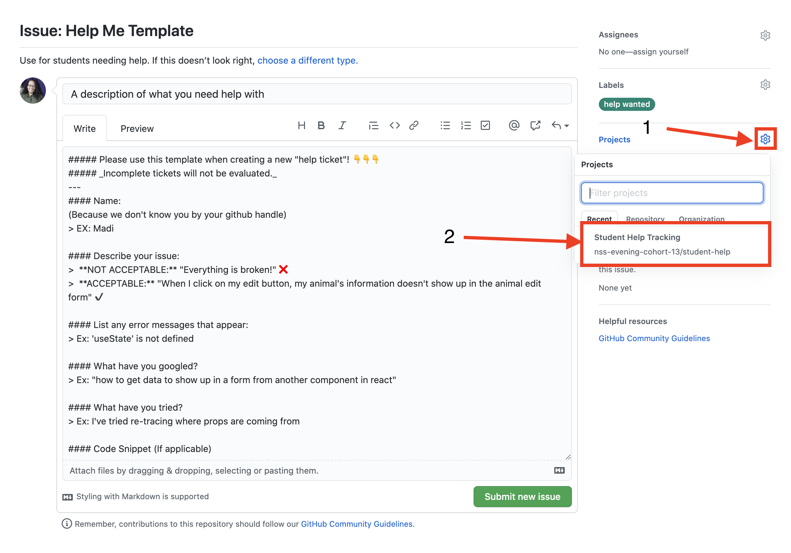
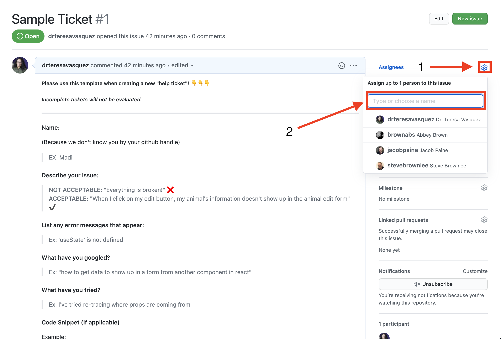

# Student Help Repo

This repo will help instructors and students help each other with code and any other issues related to the coursework.

## How to ask for help

Follow the steps below to ask for help. 

### Step 1
1. Navigate to issues
2. Check both opened and closed issues to see if someone else had your same issue
> 

### Step 2
Click "New Issue"
> 

### Step 3
Click "Get Started" on the _Help Me Template_
> 

### Step 4
1. Add a description of what you need help with in the **Title**
1. Update details as outlined in the template
> 

#### Step 5
1. Click the cog icon next to **Projects**
1. In the dropdown, click "Student Help Tracking" Option
> 

#### Step 6
1. Click the cog icon next to **Assignees**
1. Assign yourself to the issue _**(ONLY assign yourself)**_
> 

#### Step 7
Click "Submit new issue"
> 

#### Step 8
1. Continue searching for a solution to your issue
1. See if you can help another classmate
1. Patiently await help
> 

