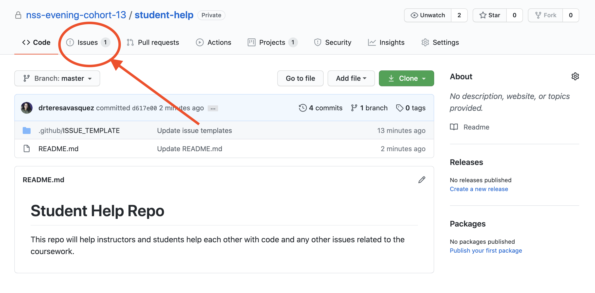
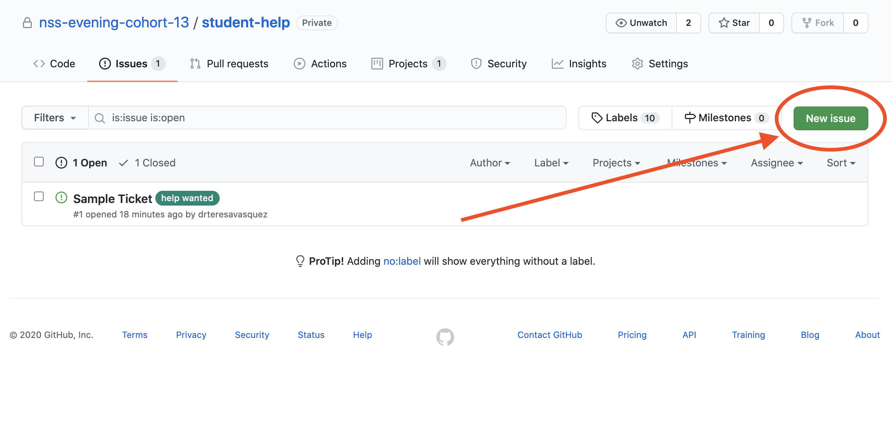
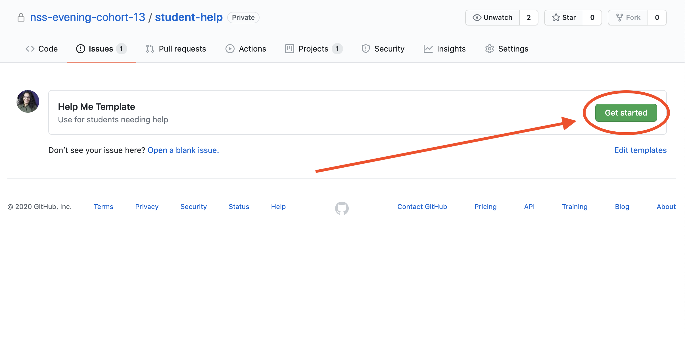
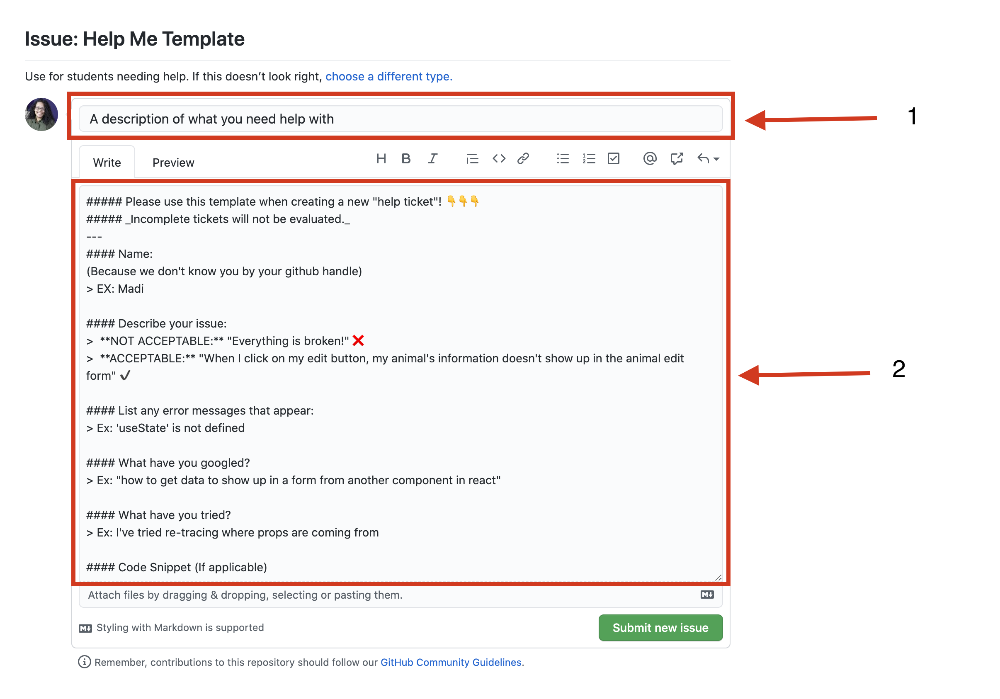
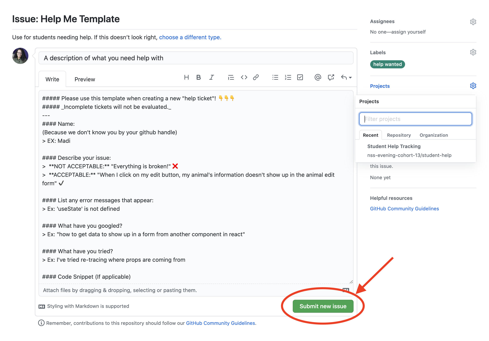

# Student Help Repo
This repo will help instructors and students help each other with code and any other issues related to the coursework.

Make sure to join the **`#ec-student-help`** slack channel to get updates on requests for help and to see other reported issues.

[Here is a resource](https://guides.github.com/features/mastering-markdown/) to help you learn about markdown to style your code and submissions.

## How to ask for help
Follow the steps below to ask for help

### Step 1
1. Navigate to issues
2. Check both opened and closed issues to see if someone else had your same issue
>  

### Step 2
Click "New Issue"
> 

### Step 3
Click "Get Started" on the Template you would like to use
> 

### Step 4
1. Add a description of what you need help with in the **Title**
1. Update details as outlined in the template
> 

#### Step 5
Click "Submit new issue"
> 

#### Step 6
1. Continue searching for a solution to your issue **(If you find a solution, add a comment with your solution then remove the help wanted tag and add issue resolved)**
1. See if you can help another classmate
1. Patiently await help
> 

